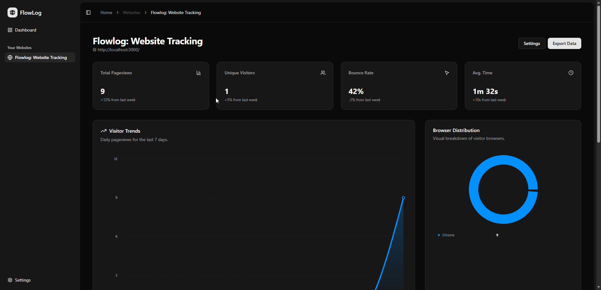
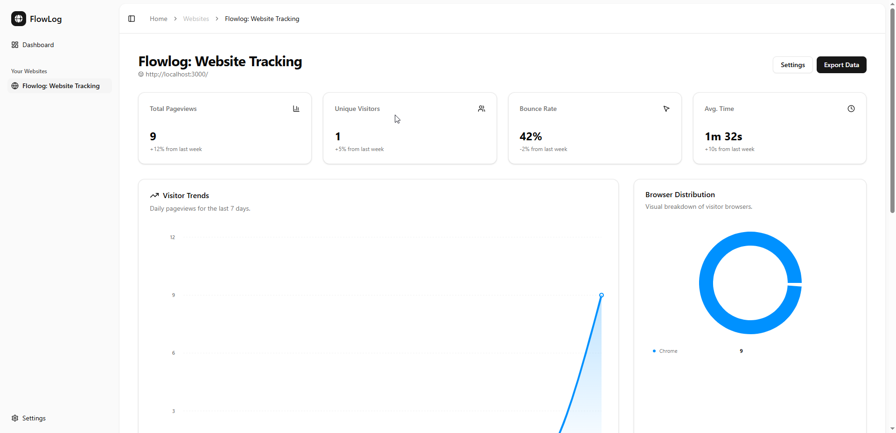
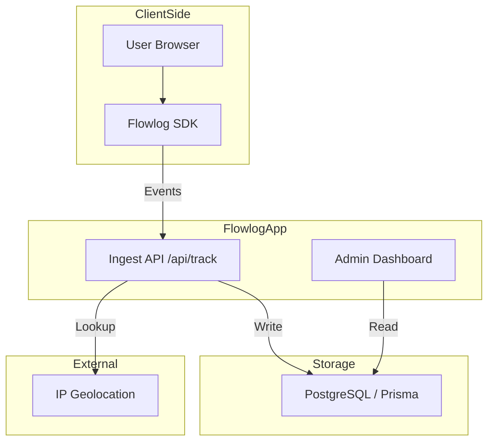

#  Flowlog

Understand Every Click. Optimize Every Flow.

Flowlog is a modern, real-time website tracking and analytics platform built for developers and product teams. It provides deep insights into user behavior with minimal performance overhead.




## Features

- **Real-time Tracking**: Monitor user interactions as they happen.
- **Flow Visualization**: Understand user paths through intuitive diagrams.
- **Privacy-focused**: Fully GDPR and CCPA compliant.
- **Developer-friendly SDK**: Integrate with just a single line of code.
- **Beautiful Dashboards**: High-performance analytics with modern aesthetics.
- **Multi-website Support**: Track and manage multiple domains from a single account.

## System Architecture



## Tech Stack

- **Framework**: [Next.js 16](https://nextjs.org/) (Turbopack)
- **Language**: [TypeScript](https://www.typescriptlang.org/)
- **Styling**: [Tailwind CSS 4.0](https://tailwindcss.com/)
- **Database**: [Prisma](https://www.prisma.io/) with [PostgreSQL](https://www.postgresql.org/)
- **Authentication**: [Better-Auth](https://better-auth.com/)
- **Analytics Logic**: [UA-Parser-js](https://github.com/fent/ua-parser-js), [Recharts](https://recharts.org/)
- **Animations**: [Motion](https://motion.dev/)
- **Package Manager**: [pnpm](https://pnpm.io/)

## Getting Started

Follow these steps to get a local development environment up and running.

### 1. Prerequisites

Before you begin, ensure you have the following installed:

- [**pnpm**](https://pnpm.io/) (v9+ recommended)
- [**PostgreSQL**](https://www.postgresql.org/) (Local instance or provider like Neon)
- [**Node.js**](https://nodejs.org/) (LTS version)

### 2. Installation

Clone the repository and install dependencies:

```bash
# Clone the repository
git clone https://github.com/lwshakib/flowlog-website-tracking.git

# Navigate to the project directory
cd flowlog-website-tracking

# Install dependencies using pnpm
pnpm install
```

### 3. Environment Configuration

Copy the example environment file and fill in your credentials:

```bash
cp .env.example .env
```

Open `.env` and configure the following key areas:

- **Database**: `DATABASE_URL` (PostgreSQL connection string)
- **Authentication**: `BETTER_AUTH_SECRET`, `GOOGLE_CLIENT_ID`, `GOOGLE_CLIENT_SECRET`
- **Email**: `RESEND_API_KEY`
- **Storage**: `AWS_ACCESS_KEY_ID`, `AWS_SECRET_ACCESS_KEY`, `AWS_ENDPOINT`, `AWS_S3_BUCKET_NAME`

### 4. Database Setup

Initialize your database schema and run migrations:

```bash
pnpm run db:migrate
```

### 5. Storage Setup

Automatically create your storage bucket (on R2/S3) and configure CORS:

```bash
# This script creates the bucket and sets the required CORS rules for browser uploads
pnpm run bucket:setup
```

### 6. Development

Start the development server with Hot Module Replacement (HMR):

```bash
pnpm dev
```

Open [http://localhost:3000](http://localhost:3000) in your browser to see the dashboard.

## Deployment & Production

To build the application for production:

```bash
# Generate the optimized production build
pnpm run build

# Start the production server
pnpm start
```

## How to Update

To keep your local instance up to date with the latest changes:

```bash
# 1. Pull the latest code
git pull origin main

# 2. Install any new dependencies
pnpm install

# 3. Run any new database migrations
pnpm run db:migrate
```

## Contributing

Please read [CONTRIBUTING.md](CONTRIBUTING.md) for details on our code of conduct, and the process for submitting pull requests to us.

## Code of Conduct

Help us keep Flowlog open and inclusive. Please read and follow [CODE_OF_CONDUCT.md](CODE_OF_CONDUCT.md).

## License

This project is licensed under the MIT License - see the [LICENSE](LICENSE) file for details.

## Maintainer

**lwshakib** - [GitHub Profile](https://github.com/lwshakib)
