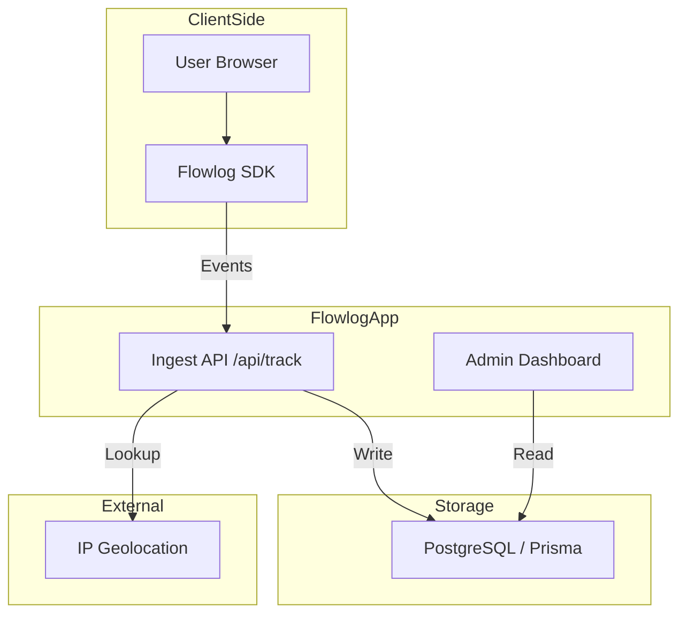

#  Flowlog

Understand Every Click. Optimize Every Flow.

Flowlog is a modern, real-time website tracking and analytics platform built for developers and product teams. It provides deep insights into user behavior with minimal performance overhead.


## Features

- **Real-time Tracking**: Monitor user interactions as they happen.
- **Flow Visualization**: Understand user paths through intuitive diagrams.
- **Privacy-focused**: Fully GDPR and CCPA compliant.
- **Developer-friendly SDK**: Integrate with just a single line of code.
- **Beautiful Dashboards**: High-performance analytics with modern aesthetics.
- **Multi-website Support**: Track and manage multiple domains from a single account.

## System Architecture



## Tech Stack

- **Framework**: [Next.js 16](https://nextjs.org/) (Turbopack)
- **Language**: [TypeScript](https://www.typescriptlang.org/)
- **Styling**: [Tailwind CSS 4.0](https://tailwindcss.com/)
- **Database**: [Prisma](https://www.prisma.io/) with [PostgreSQL](https://www.postgresql.org/)
- **Authentication**: [Better-Auth](https://better-auth.com/)
- **Analytics Logic**: [UA-Parser-js](https://github.com/fent/ua-parser-js), [Recharts](https://recharts.org/)
- **Animations**: [Framer Motion](https://www.framer.com/motion/)
- **Package Manager**: [Bun](https://bun.sh/)

## Getting Started

### Prerequisites

- [Bun](https://bun.sh) installed on your machine.
- A PostgreSQL database (Neon, local, etc.).

### Installation

1. Clone the repository:

   ```bash
   git clone https://github.com/lwshakib/flowlog-website-tracking.git
   cd flowlog-website-tracking
   ```

2. Install dependencies:

   ```bash
   bun install
   ```

3. Set up your environment variables:
   Copy `.env.example` to `.env` and fill in your database and auth credentials.

   ```bash
   cp .env.example .env
   ```

   **Required Variables:**
   - `DATABASE_URL`: Your PostgreSQL connection string.
   - `BETTER_AUTH_SECRET`: A secure random string for encryption.
   - `RESEND_API_KEY`: For email verification and notifications.

4. Run database migrations:

   ```bash
   bun db:migrate
   ```

5. Start the development server:

   ```bash
   bun dev
   ```

Open [http://localhost:3000](http://localhost:3000) with your browser to see the result.

## Contributing

Please read [CONTRIBUTING.md](CONTRIBUTING.md) for details on our code of conduct, and the process for submitting pull requests to us.

## Code of Conduct

Help us keep Flowlog open and inclusive. Please read and follow [CODE_OF_CONDUCT.md](CODE_OF_CONDUCT.md).

## License

This project is licensed under the MIT License - see the [LICENSE](LICENSE) file for details.

## Maintainer

**lwshakib** - [GitHub Profile](https://github.com/lwshakib)
